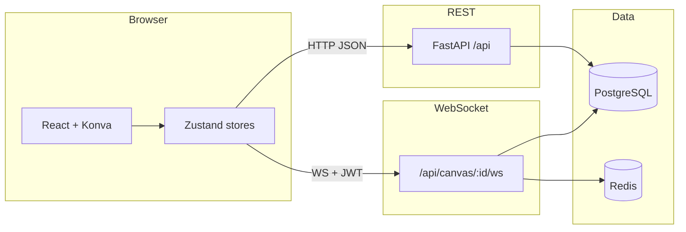

# Collab Canvas

A **real-time collaborative canvas** inspired by design tools like Figma. Users sign up, create or join canvases via share links, draw shapes on an infinite canvas (pan/zoom), edit properties, and collaborate with **live cursors**, **element-level locking**, and **WebSocket-synced** updates.

---

## Features

- **Authentication** — JWT-based signup/login (`/api/auth/*`).
- **Canvases** — Create, list, delete, and open canvases from a dashboard; **share links** invite collaborators (full edit access in MVP).
- **Editor** — Rectangle, circle, line, triangle, and text tools; drag, resize, inline text editing; property panel (fill, stroke, opacity, rotation, z-index, text styling).
- **Undo / redo** — Session history with keyboard shortcuts.
- **Real-time** — Authenticated WebSocket per canvas (`/api/canvas/:id/ws?token=…`) for element broadcasts, presence, and locks.
- **Locking** — Selecting an element acquires an exclusive lock (Redis `SETNX` + TTL); heartbeat while selected; others see a lock overlay.
- **Persistence** — PostgreSQL for users, canvases, and elements; **debounced REST** saves after local edits settle (not a fixed timer).
- **Resilience** — WebSocket reconnect with backoff; REST resync after reconnect; **`lock:snapshot`** on connect so lock UI matches the server.

---

## Tech stack

| Layer | Technologies |
|--------|----------------|
| **Frontend** | React 19, TypeScript, Vite 8, React Router 7 |
| **Canvas** | Konva + react-konva |
| **Client state** | Zustand |
| **API** | FastAPI, Pydantic Settings, Uvicorn |
| **Data** | PostgreSQL (SQLAlchemy 2 + Alembic), Redis (locks, presence, cursors) |
| **Auth** | JWT (`python-jose`), bcrypt passwords |
| **Testing** | Vitest + Testing Library (client), pytest (server) |

---

## How it works (high level)



1. **REST** (`/api` prefix): auth, canvas CRUD, element CRUD, share URL. Element writes require the client to hold the lock (server returns **423** when appropriate).
2. **WebSocket**: After connect, the server sends `connected`, `room:peers`, and **`lock:snapshot`**. Clients send `cursor:move`, `lock:acquire` / `lock:release` / `lock:heartbeat`, and receive `element:*`, lock events, and presence broadcasts.
3. **Local edits** are merged into Zustand; a **debounced** hook persists to REST when the element list changes. Remote edits arrive over WebSocket and update the same stores.

For product scope and pitfalls, see **[`PRD.md`](./PRD.md)**. For a diagram-oriented view of the client and server layout, see **[`architecture.md`](./architecture.md)**.

---

## Repository layout

```
collab-canvas/
├── client/                 # Vite React app (src: app, components, features, hooks, services, pages)
├── server/                 # FastAPI app (app: api, core, db, models, schemas, services, websocket, redis)
├── docker-compose.yml      # PostgreSQL + Redis only (dev)
```

Detailed task breakdown: **[`tasks.md`](./tasks.md)**.

---

## Prerequisites

- **Node.js** 20+ (recommended) and **npm**
- **Python** 3.11+
- **[uv](https://docs.astral.sh/uv/)** (recommended) or another tool to install the server’s `pyproject.toml` dependencies
- **Docker** (for local Postgres + Redis)

---

## Local development

### 1. Start databases

From `collab-canvas/`:

```bash
docker compose up -d
```

This starts PostgreSQL (`localhost:5432`) and Redis (`localhost:6379`) with credentials matching the defaults in [`server/app/core/config.py`](collab-canvas/server/app/core/config.py).

### 2. Configure the backend (optional)

Create `collab-canvas/server/.env` if you need to override defaults. Common variables:

| Variable | Purpose |
|----------|---------|
| `DATABASE_URL` | PostgreSQL connection string |
| `REDIS_URL` | Redis connection URL |
| `JWT_SECRET` | **Change in production** for signing tokens |
| `CORS_ORIGINS` | Allowed browser origins (e.g. `http://localhost:5173`) |

### 3. Run migrations and the API

```bash
cd collab-canvas/server
uv sync
uv run alembic upgrade head
uv run uvicorn app.main:app --reload --host 0.0.0.0 --port 8000
```

Health check: `GET http://localhost:8000/health`

### 4. Run the client

In another terminal:

```bash
cd collab-canvas/client
npm install
npm run dev
```

Vite serves the app at **http://localhost:5173** and **proxies** `/api` and `/health` to `http://localhost:8000` (see [`vite.config.ts`](collab-canvas/client/vite.config.ts)), so the browser can call `/api/...` without CORS issues during development.

---

## Scripts

| Location | Command | Description |
|----------|---------|-------------|
| `client/` | `npm run dev` | Vite dev server |
| `client/` | `npm run build` | Production build |
| `client/` | `npm run test` | Vitest (run once) |
| `server/` | `uv run pytest` | Backend tests |

---

## Documentation

| File | Contents |
|------|----------|
| [`PRD.md`](./PRD.md) | Product requirements and MVP scope |
| [`architecture.md`](./architecture.md) | System diagram (Mermaid) |
| [`tasks.md`](./tasks.md) | PR-style implementation checklist |

---

## License

Add a `LICENSE` file and describe it here if you publish the repo publicly.
